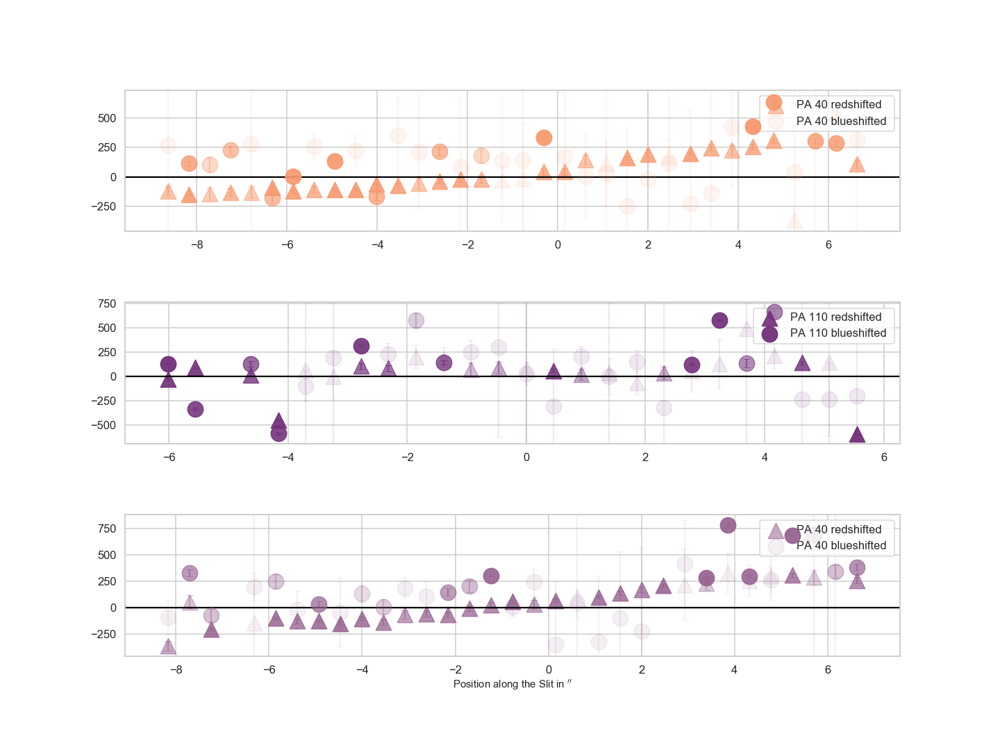
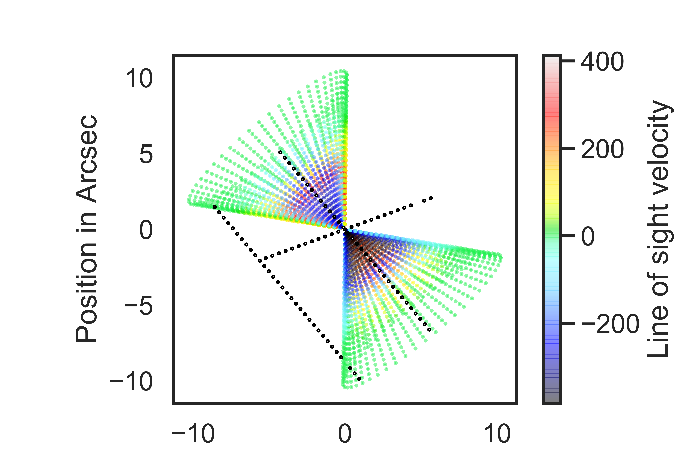
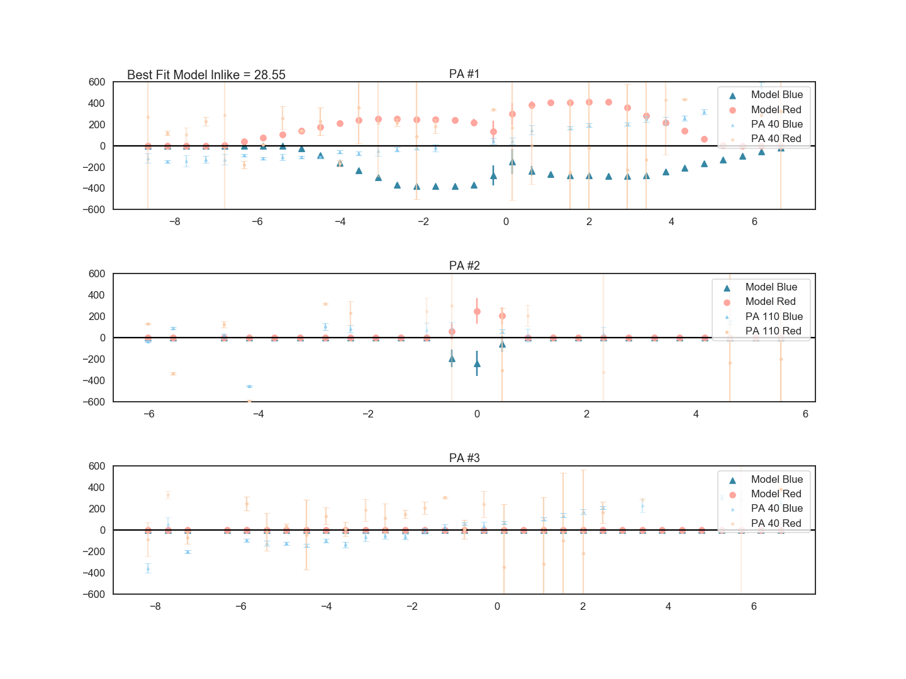
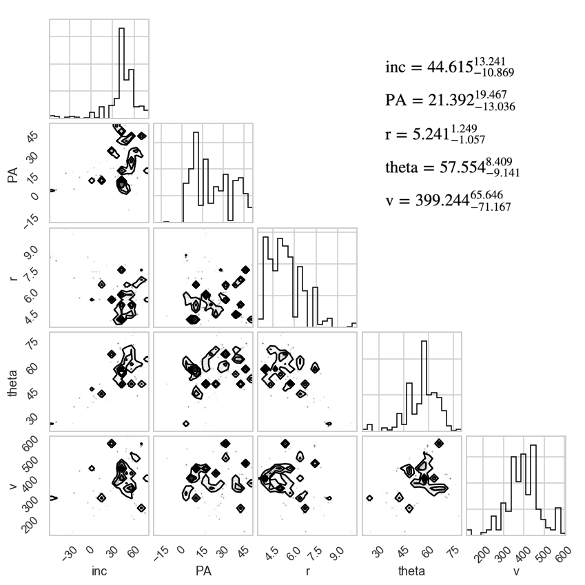

This tool creates an analytic model for a biconical outflow based on five parameters (inclination, position angle on the sky, size, opening angle, and max velocity). The velocity law along the wall of the cone is a constant velocity at vmax out until the turnover radius and then a linear deceleration.

The tool creates the bicone, extracts mean velocities using a grid that is centered at a list of points, meaning that it can extract points along longslits or along IFS maps, and then it compares the model to the data in an interative emcee process.

The product is posterior distributions around the five input parameters.

Here is an example of the input data, which is the centroids of two Gaussians for two different longslit PAs in this example:

Here is an example of a model bicone with overplotted longslit positions of the data:

Here is an example of the output model plotted against this data with the best fit lnlike value:

And here is an example of the best fit parameters in corner plot form:
